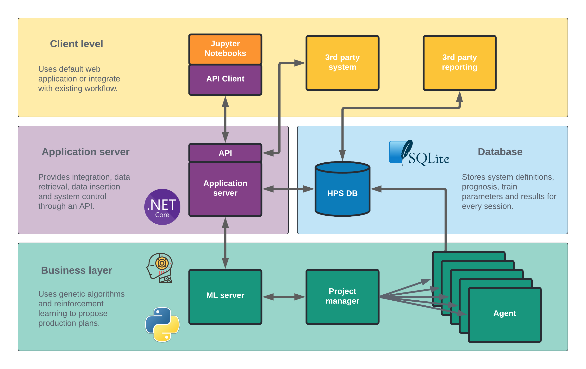

# HydroRL: A Reinforcement Learning Approach to Hydropower Scheduling

## Project Description

### Introduction
The HydroRL is a reinforcement learning based model to perform hydropower scheduling. It has packages to construct hydro power systems and running Stable Baselines3 (SB3) based RL algorithms. 

### Problem statement
The problem we are trying to solve is to maximize the utilization of the hydropower system, which is modelled by reservoirs, power stations, gates and connections between them. The model requires a forecast of energy prices and inflows to the reservoirs. Based on those forecasts and the required configuration (time horizon, end value, etc.) the model aims at maximizing the expected reward of the specified time horizon.

### Performance
For problems with weekly time resolutions we managed to get comparable results as to another model based on Stochastic Dual Dynamic Programming (SDDP), used commercially by hydropower companies. This was also the case for more complex hydropower systems, with multiple waterways, reservoirs and power stations. 

For problems where we increased the time resolution, from daily to hourly we observed that the model struggled with converging. We tried a variety of hyperparameter tuning, reward function tuning, splitting the problem into a short-term (hourly) and long-term (weekly) model but where not able to obtain comparable results as the model based on SDDP.

Note that in an earlier version we used Tensorflow Agents as the RL engine, however, we found SB3 to be easier to work with. 


## Overview
The HydroRL application consist of one flask application that consist of the business layer, an application server that hosts the client facing API written in .NET Core, and the sqlite database.

Below is an overview of the different components of the HydroRL application.



For more details on the stack and different components see [SYSTEM_OVERVIEW](SYSTEM_OVERVIEW).


## Usage
### Prerequisite
The easiest way to get started is to start the application with [docker compose](https://docs.docker.com/compose/), follow [these](https://docs.docker.com/compose/install/) instructions to install it. This takes cares of all the nitty details and ensures you have an running application.

### Installation
After docker composed is installed, clone this repo:
```
git clone https://github.com/Fraktal-Norge-AS/HydroRL.git
```

### Running the application
Create a directory `hps_server` directory in `/home/${USER}/`, it will be used to store the HPSDB.db and the logging database. The location of this database can changed by altering the volume location in the [docker-compose.yml](docker-compose.yml) file.

Build the docker containers (note that this might take a couple of minutes):
```
docker compose build
```

Run the application
```
docker compose up
```

If everything succeeds you can now query the API on http://0.0.0.0:5400. 

You might have to change the access rights to the database files. If you experience an error (`sqlalchemy.exc.OperationalError: (sqlite3.OperationalError) attempt to write a readonly database`) change the permissions of the databases:

```
cd /home/${USER}/hps_server/
chmod 774 HPSDB.db log.db
chown ${USER}:${USER} HPSDB.db log.db
```

You should now be able to read and write to the database. 

Install python 3.7 and run 
```
python -m venv .venv
source .venv/bin/activate
pip install -r requirements.txt
```
Populate the database with data by running these two scripts

```
python scripts/insert_hydro_system_to_db.py
python scripts/insert_example_forecast_to_db.py
```
The last script will take a few minutes to run.

Now, open some of the notebooks located in `notebooks/APIDemo/` to see how to use the model. 

## License
This project is licensed under the MIT License. See the [LICENSE](LICENSE) file for details.

## Acknowledgement
We would like to thank Sindre Tøsse, Vegard Kyllingstad and Øyivind Høivik at Lyse Produksjon AS for providing data and feedback to the project. 

Team members at Fraktal involved on the project:
 - Jan Ivar Kjøde
 - Lars Kartevoll
 - Martin Hjelmeland
 - Stian Bakke
 - Siv Sødal

## Contact and Support
For any queries or support please contact martin.hjelmeland@ntnu.no.