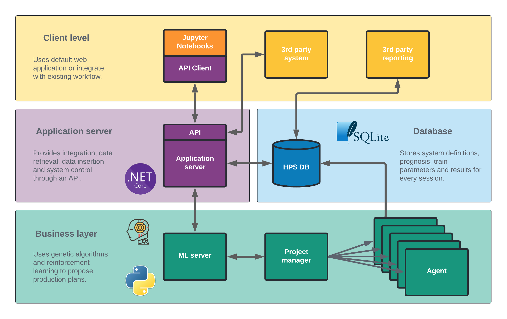

# HydroRL

## Technology

### Programming Languages

The HydroRL project is mostly implemented in 2 different programming languages. The customer facing part (API) is a .NET web application, while the business logic/backend is running as a python service. The rationale behind this is purely pragmatic, based on the availability of libraries and development tools.
There was also a web application implemented in C# .NET and javascript, but this is now considered redundant, since we are moving towards using jupyter notebooks as our client facing application.

 * C# /.NET
 * Python
 * (TypeScript/JavaScript)
 * (HTML)

### Database technology

The database used during development and first deployment is SQLite. This choice was made based on its very low footprint, in-proc transactions and speed. If long-term requirements change, however, trading SQLite for a different technology will be quite effortless. Very few dependencies on the database tech are present since we use SQL through SQLAlchemy and Entity Framework.

 * [SQLite](https://www.sqlite.org/index.html) 
 * Entity framework (.NET)
 * [SQLAlchemy (Python)](https://www.sqlalchemy.org/)
 

### Reinforcement Learning

HydroRL uses reinforcement learning to fulfill its mission. Initially a framework called Tensorflow Agents was used to realize our RL models, but as the open source community abandon this project, so did we. We suspect bugs were present in the library, and much better results were achieved when we moved to the Stable Baselines implementation of RL.
TF Agents was based on the tensorflow library, but with the move to SB3 we also migrated to pytorch.

 * [Stable Baselines 3](https://stable-baselines3.readthedocs.io/en/master/)
 * [PyTorch](https://pytorch.org/)

### Development environment

 * [VS Code](https://code.visualstudio.com/download)
 * [VS Code Remote development](https://code.visualstudio.com/docs/remote/ssh)

## Architecture

At its core the HydroRL is a service which customers utilize in their own workflows through an API, and we provide no standard client tool.
We do however provide examples as jupyter notebooks to facilitate this integration and for demo purposes, and the **API Client** library is considered a part of the system. 
An effort has been made to hide the complexities of the system from the customer, and the API/API Client exposes only high-level concepts.

 * Client server model
 * Lightweight integration

### Business layer

From an external point of view, the business layer has only 2 entry points/api functions, both intended to be invoked from the application server.
These api functions are not intended to be invoked directly by the 3rd party, but should be used exclusively by the application server.

 * start : Start async training of agents for the specified project run.
 * evaluate : Start async evaluation for a project

Both these functions require data structures to be present in the database a-priori, and this facilitation is usually performed in the application layer.
When the asynchronous processing is complete, this is signaled back to the application layer through the database.

In order to be responsive, and given the lack of multithreading support in our chosen technology stack, multiple processes will be started when the business layer is presented a task.

The main process is running as a [flask app](https://flask.palletsprojects.com/en/2.1.x/) which receives the http request. 
A start or evaluate request will then immediately spawn a background process which performs the actual work.

#### Evaluate
In case of an evaluation, the background process executes the necessary logic, produces the results into the database and terminates.

#### Start (start agent training)
If a training is started, the background process again spawns a new process per requested agent to be trained (5 by default).
Each agent will independently perform the training task and then terminate.
The background process monitors the execution of these agents and, upon completion of all of them, sets the appropriate status in the database and terminates.

#### Risks
 1. If unexpectedly terminated, both training and evaluation will leave the database in an inconsistent state. The task will never be formally terminated and processing will NOT resume when the server is started up anew.
 2. Since multiple processes are accessing the SQLite database "simultaneously", and the locking mechanism is in reality a [file lock](https://en.wikipedia.org/wiki/File_locking), the behavior is dependant on [file system support](https://www.sqlite.org/lockingv3.html). 

### Database

#### Core schema

The central concepts from an API perspective is the Project and tables associated with settings and forecast.

 * A **Project** can be considered a work-item on a **HydroSystem** and can have multiple **ProjectRuns**.
 * A **ProjectRun** can represent a single training session of one or more **Agents** on the same **Forecast** within the boundaries of a **Project**.
 * A **ProjectRun** can also represent an evaluation of a single agent on a **Forecast** within the boundaries of a **Project**.
 * A **HydroSystem** defines the static structure of the real life composition of reservoirs and power stations.
 * A **Forecast** is a collection of price-and-inflow-scenarios which represent the theoretical outcomes used during training of the **Agents**
 * An **Agent** corresponds to the similar concept in [Reinforcement Learning](https://en.wikipedia.org/wiki/Reinforcement_learning).

#### Hydro system

* A **HydroSystem** consists of several **Reservoirs**
* For a single **ProjectRun** these **Reservoirs** have a defined initial volume (**ProjectRunStartVolume**)
* A **Forecast** is defined for a **HydroSystem**

#### Forecasts

* A **Forecast** has multiple **SeriesLinks** where each link represents the price outcome given a certain inflow scenario.
* Each **SeriesLink** therefore refers to one **TimeDataSeries** for price and one for inflow.
* A **TimeDataSeries** has multiple **TimeDataValues**, typically one per 3 hours over a 5 year period.
* The **Uploads** table is there for traceability, and denotes the source file and time the forecast was added to the system.

#### Training data
* An **Agent** writes diagnostic data during training. This information ends up in the tables **TrainStepData** and **TrainStepValues**
* **TrainStepData** represents a series of values relating to a specific concept, e.g. reward or training loss.
* **TrainStepValue** is a single value in the data series.

#### Evaluation data
* An **Agent** writes evaluation data at the end of training.
* A **ProjectRun** can also be evaluated, and the evaluation is then performed on the agent that achieved the best peak reward during training of that run.
* **EvaluationEpisodes** are the result of this evaluation, one for each scenario in the **Forecast** used for training.
* An evaluation of a single scenario, can contain multiple data series, represented by **ReportData**. Examples of series are volume, reward, price, etc.
* Each series consists of multiple **ReportValues**

#### Control signals
* The database is used for communication between the Application Server (.NET) and the Business Layer (Python).
* **ProjectRunControls** and **AgentControls** are tables that are used to signal early termination of a training session, typically requested over the API.

### Application Server
The **Application Server** exposes the customer API and is responsible for translating API requests into SQL queries and further requests towards the **Business Layer**.
Most API operations translate to read or write operations towards the **Database**, such as "Create Project" and "Read evaluation data".

The RunProject and Evaluate operations are however somewhat more complex as depicted below.

#### Risks
Since the operations performed in the Business layer are asynchronous relative to the flask server, there is a risk that the operation fails and that cleanup in step 4 therefore is not performed correctly.

### API Client

As mentioned, a client-side Python library has been produced to facilitate end user development and integration.
This library has to be maintained and extended to match the functionality of the API contract exposed server-side.
A [tool](webapp/PythonGen.cs) has been developed to ensure that the domain objects in the library are synchronized with those defined on the server side.
This tool needs to be run when changes are made to the domain model. The functional Client side API must be manually maintained for mow.

