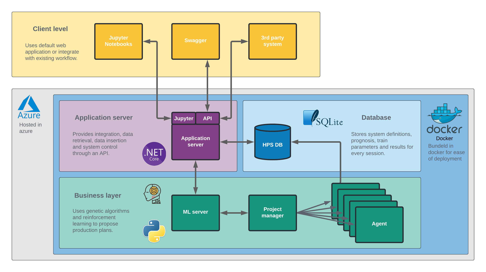

.. HydroRL documentation master file, created by
   sphinx-quickstart on Mon Aug  2 12:06:36 2021.
   You can adapt this file completely to your liking, but it should at least
   contain the root `toctree` directive.

Welcome to HydroRL's documentation!
===================================

:Version: |release|

The aim of this site is to provide documentation for the Hydro RL model. We have separated this site into four parts: Modelling of the hydro system, the stochastic variables, the reinforcement learning algorithm, and the API. 

   Illustration of the HydroRL Architecture.

.. toctree::
   :maxdepth: 2
   :caption: Hydro System
   
   hydro_system.md
   hps   

.. toctree::
   :maxdepth: 2
   :caption: Stochastic Variables

   notebooks/StochasticVariables.ipynb

.. toctree::
   :maxdepth: 2
   :caption: Reinforcement Learning

   RL.md
      
.. toctree::
   :maxdepth: 2
   :caption: API Overview and Example Notebooks

   apiweb.rst
   python_clients.md
   notebooks.md
  

.. _header_target:

Indices and tables
==================

* :ref:`genindex`
* :ref:`modindex`
* :ref:`search`

